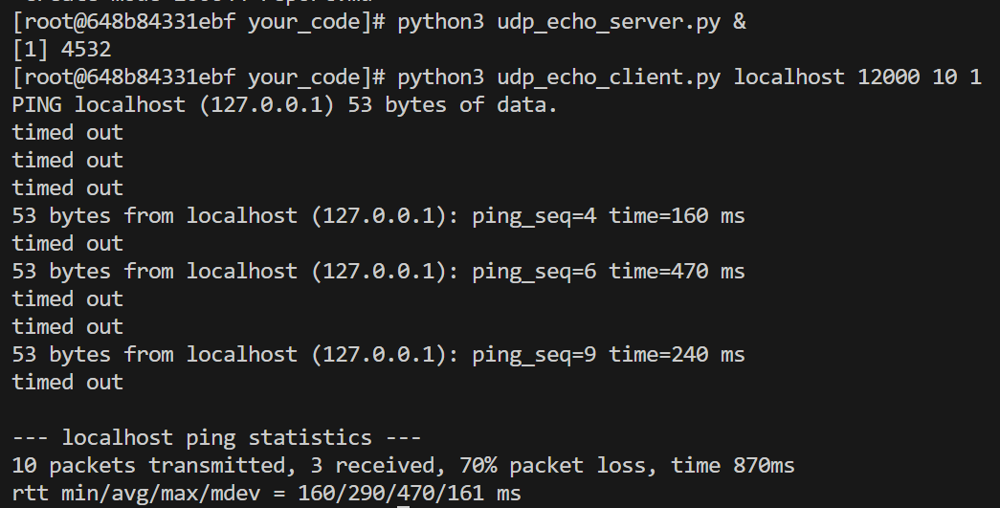

Report
Adam Camerer

I tested this by running the udp server in the background. I then ran the command to run my local server from the custom test one, which I determined to be correct based on the output.