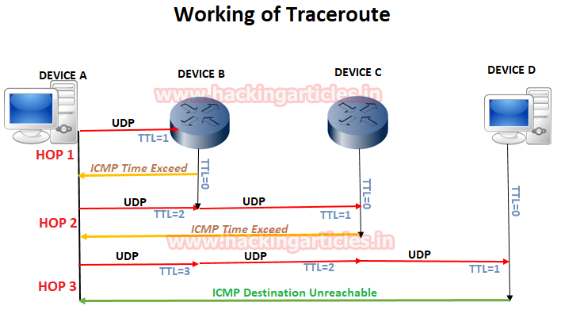

This assignment is an optional bonus.
You do not have to do it.
If you do it, then the grade you get on it can replace your lowest programming grade

# PA04 - ICMP ping and traceroute using scapy


## Background
Review your previous assignment:
* `pa03_udp-echo`

Read: 
* https://en.wikipedia.org/wiki/Traceroute
* https://www.reddit.com/r/ProgrammerHumor/comments/7eup2v/traceroute_badhorse/

```bash
whatis traceroute
which traceroute
man traceroute
traceroute --help
traceroute 127.0.0.1
traceroute mst.edu
traceroute mit.edu
traceroute epfl.ch
traceroute bad.horse
```



 


In this assignment you will implement with scapy, both:
* a realistic ICMP version of ping, and
* a realistic ICMP version of traceroute.

Constraints: 
* Don't use the python `socket`, 
  **except** for the already-imported functions for DNS lookups.
* There is a traceroute functionality in scapy, 
  but don't use it!
* Try to mimic it using the ICMP packets alone, 
  though it would not hurt to try both.

# Steps
1. Review python3-scapy by reading the following:
	* https://scapy.readthedocs.io/en/latest/
    * https://github.com/0xbharath/art-of-packet-crafting-with-scapy
	* https://github.com/secdev/scapy 
      (section of README.md called "Resources" has a couple iPython notebook tutorials)

2. Read and run the code provided for these using raw sockets. 
   Notice how much the little details matter.
   If you break even the checksum, 
   then responses don't come back!

3. Mimic basic ping and basic traceroute using scapy.
   Notice how much easier it is for ICMP!

Notes: 
Some websites might not want to respond to UDP/TCP/ICMP packets, 
and thus not regular ping/traceroute, on different platforms.
Also, your ISP may censor such packets on the source end too.
So, you may need to try different sites on different internet connections to test. 
MST's on-campus connection blocks ICMP echo packets with id=0 and seq=0, 
so make sure to set these fields to something random.
For this assignment, exact timing is not graded,
but it should still be included. 
Format it like last assignment for ping,
and to three decimal places for traceroute.

# Deliverables
Submit these files/edits, for example:
* `icmp_ping_client_scapy.py mst.edu`
	* should produce essentially what normal `ping` produces.
    * It should be run as:
      `sudo python3 icmp_ping_client_scapy.py <hostname> <num pings> <timeout>`
* `icmp_traceroute_client_scapy.py`
	* Should produce essentially what normal `traceroute` produces.
    * It should be run as:
      `sudo python3 icmp_traceroute_client_scapy.py <hostname>`
* `report.md`
    * includes markdown-embedded images of how you ran your code, 
      and what success looked like, 
      along with any brief notes you want us to know.
